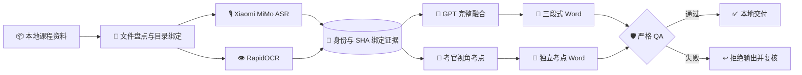

<div align="center">

# 📚 Course Evidence Forge

### 🎙️ ASR · 👁️ OCR · 🧠 GPT 融合 · 📝 考点提取 · 📄 Word 交付

一套面向视频、音频、PDF、PPT、Word、图片与压缩包的本地优先课程资料处理流水线。

<p>
  
  
  
  
</p>

<p>
  
  
  
  
</p>

> 🔐 这是公开安全分支：仓库不包含真实课程文件、识别证据、最终 Word、模型文件、API Token 或真实文件身份映射。

</div>

---

## ✨ 项目能力

| 模块 | 能力 | 关键约束 |
|---|---|---|
| 🎙️ MiMo ASR | 连续音频分段、失败重试、断点续跑 | 正式证据只接受 Xiaomi MiMo ASR |
| 👁️ RapidOCR | 视频逐秒帧、场景变化帧、课件页面与嵌入对象 | 保留原始顺序与可追溯定位 |
| 🧠 GPT 融合 | 直接理解 ASR 与 OCR 后撰写完整课程正文 | 不把两路底稿机械拼接进融合区 |
| 🎯 考点提取 | 从考官视角建立题型、答案要素、易错点 | 每个考点必须绑定证据 Pointer |
| 📄 Word 导出 | 目录顺序、三段式正文、颜色隔离 | ASR/OCR 黑色，GPT 最终正文红色 |
| 🛡️ 严格 QA | 身份、SHA、Schema、顺序、凭据与样式检查 | 任一失败即拒绝正式导出 |

## 🧭 全链路



### 三段式交付边界

```text
每个课程资产
├── 1. ASR 结果      黑色 · MiMo 原始语音证据
├── 2. OCR 结果      黑色 · 原始画面/课件证据，碎片用空格拼接
└── 3. GPT 融合结果  红色 · 模型理解后的最终完整正文
```

GPT 融合区只放最终课程内容，不重复放置“完整 ASR 底稿”“完整 OCR 底稿”或技术处理说明。

## 🚀 快速开始

### 1. 创建环境

```bash
python3.12 -m venv .venv
source .venv/bin/activate
pip install -r requirements.txt
```

### 2. 配置 MiMo

密钥仅通过隐藏输入或环境变量提供，禁止写入源码、README、命令历史或 JSON 结果。

```bash
export MIMO_API_KEY='<your-token-plan-key>'
export MIMO_API_BASE_URL='https://token-plan-cn.xiaomimimo.com/v1'
```

### 3. 处理单个视频

```bash
.venv/bin/python -m media_pipeline.runner '/absolute/path/to/video.mp4'
```

工作结果写入被 Git 忽略的 `.work/single-video/<sha256-prefix>/`。重跑时会验证源文件指纹与配置，并复用已经完成的音频段和视频帧。

### 4. 本地导出

```bash
.venv/bin/python -m media_pipeline.fusion \
  '.work/single-video/<sha256-prefix>' \
  --content '.work/single-video/<sha256-prefix>/fusion_content.json' \
  --output 'outputs/course_ASR-OCR-GPT.docx'
```

导出动作不会自动生成或改写 GPT 正文；它只验证身份并排版已经审定的内容。

## 🧱 第一性原理约束

1. **证据先于正文**：先形成完整、可定位的 ASR/OCR 证据，再进行 GPT 理解。
2. **源文件不可替换**：资产 ID、源 SHA、证据 SHA 和任务 SHA 必须一致。
3. **正文不可自动回填**：缺少 GPT 结果时直接拒绝，不使用旧稿或原始底稿兜底。
4. **冲突不可擅断**：ASR 与 OCR 不一致时显式记录，不能悄悄选择其中一个。
5. **目录顺序不可改变**：Word 排列由权威目录绑定，不按文件系统名称排序。
6. **敏感数据不入 Git**：所有真实资料与结果只留本地，不使用 `git add -f` 绕过规则。

## 🧪 测试

```bash
.venv/bin/python -m unittest discover -s tests -p 'test_*.py'
```

测试覆盖身份哈希、MiMo ASR、视频 OCR、课件无损提取、任务切块、GPT 融合边界、考点证据定位、Word 颜色隔离、目录顺序、密钥扫描与只读交付 QA。

## 🗂️ 目录结构

```text
course-evidence-forge/
├── media_pipeline/       # 🎙️ ASR、👁️ OCR、🧠 融合与 📄 报告模块
├── scripts/              # 🛠️ 盘点、任务准备、校验、合并与导出工具
├── tests/                # 🧪 自动化测试
├── docs/                 # 📚 公开安全的设计约束与操作说明
├── config/               # ⚙️ 脱敏配置示例
├── data/                 # 🔒 本地源资料，Git 忽略
├── .work/                # 🔒 本地证据与中间结果，Git 忽略
├── outputs/              # 🔒 本地 Word 交付，Git 忽略
└── models/               # 🔒 本地模型，Git 忽略
```

## 🔒 数据安全与本地保留

| 路径/类型 | Git 状态 | 处理原则 |
|---|:---:|---|
| `data/` | 🚫 忽略 | 原始视频、课件、压缩包原样保留本地 |
| `.work/` | 🚫 忽略 | ASR/OCR、帧图、证据 JSON 与人工结果保留本地 |
| `outputs/` | 🚫 忽略 | 最终 Word 不上传公开仓库 |
| `models/`、`.venv/` | 🚫 忽略 | 大模型与运行环境不进入 Git |
| `.env*`、API Token | 🚫 禁止 | 仅使用环境变量或隐藏输入 |
| 源码、脱敏文档、测试 | ✅ 可提交 | 提交前必须通过凭据和文件大小检查 |

本分支不使用数据库，也不对 Quiz Forge 应用的 IndexedDB 执行读取、迁移或删除操作。所有清理动作必须在完成备份并确认精确路径后单独执行。

## 🌿 分支命名规则

同一 GitHub 仓库使用统一的项目分支格式：

| 分支 | 项目 |
|---|---|
| `project/quiz-forge-app` | 🛡️ Quiz Forge 离线刷题应用 |
| `project/yw-course-asr-2026` | 📚 当前 ASR/OCR/GPT 课程资料工程 |
| `project/<project-slug>` | 🧩 后续独立项目 |

不同项目通过分支隔离，切换分支前请先保存当前工作区。

## 📚 延伸文档

- [GPT 融合正文契约](docs/gpt-fusion-contract.md)
- [考点独立交付规范](docs/exam-points-delivery-spec.md)
- [考点结构模板](docs/exam-points-structure-template.md)
- [考点批次操作手册](docs/exam-points-batch-runbook.md)

---

<div align="center">

### 🧩 完整证据 · 严格边界 · 可追溯交付

<sub>Public-safe branch — source data and reviewed deliverables stay local.</sub>

</div>
